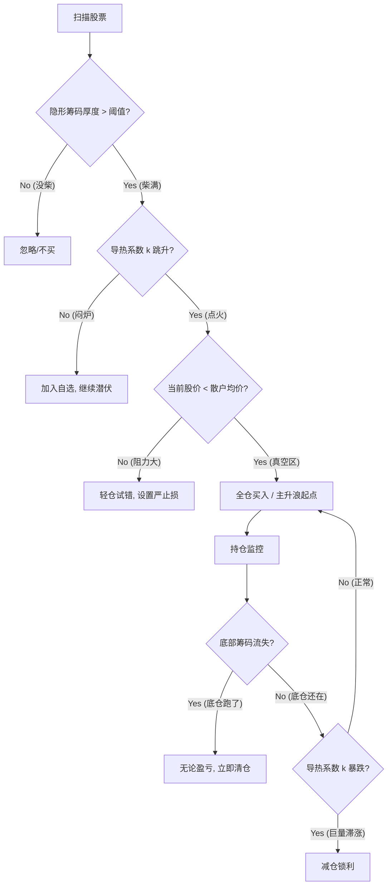

这是一个非常必要的补充。如果没有这份**“全地形作战手册”**，再好的模型也可能因为操作者的犹豫或误判而失效。

我们将这个部分命名为 **《隐形筹码热力学模型·实战状态机 (State Machine)》**。

它将股票的生命周期划分为 4 个物理阶段，并针对 3 种极端异常情况给出了明确的**“If-Then”**指令。

---

# 隐形筹码热力学模型 · 实战应对指南

## 第一部分：标准生命周期应对 (Standard Lifecycle)

我们将股票看作一个热力学系统，根据**能量（隐形筹码）**和**效率（导热系数）**的变化，将行情分为四个阶段：

### 1. 冰河期 / 筑底阶段 (Accumulation / Insulation)

* **状态描述：** 股价低迷，甚至阴跌，无人问津。
* **模型读数：**
* **温度 ()：** 极低（低位徘徊）。
* **隐形筹码 ()：** **持续增长**。模型显示主力正在通过微小的震荡（做T）不断从上方搬运筹码到下方。
* **导热系数 ()：** ****。怎么买都不涨（闷炉）。

* **操作指令：** **【潜伏/观察】**
* **切勿动手：** 此时买入会浪费巨大的时间成本。
* **加入自选：** 标记为“燃料已满，等待点火”。

### 2. 点火期 / 启动阶段 (Ignition / Breakout)

* **状态描述：** 突然放量，脱离底部盘整区。
* **模型读数：**
* **温度 ()：** 出现  的阳线。
* **导热系数 ()：** **跳升**。单位成交量带来的涨幅巨大（主力撤掉压单，甚至主动对倒拉升）。
* **阻力位：** 股价 **** 散户均价线（上方是真空区）。

* **操作指令：** **【全仓突击】**
* 这是模型胜率最高、盈亏比最好的时刻。确认  值跳变，直接扫货。

### 3. 烈火期 / 主升浪 (Combustion / Markup)

* **状态描述：** 股价沿均线持续上涨，中间可能伴随洗盘。
* **模型读数：**
* **隐形筹码：** 底部筹码**锁定不动**（主力没跑）。
* **导热系数 ()：** 维持高位（上涨顺滑）。
* **阻力位：** 股价开始穿越 **散户均价线**。

* **操作指令：** **【持仓/加仓】**
* **穿越均价时：** 观察  值。如果穿越时放量滞涨（导热下降），减仓一半做 T；如果缩量穿越（导热极高），死拿不动。
* 只要底部隐形筹码不松动，任何回调都是假摔。

### 4. 灰烬期 / 出货阶段 (Ash / Distribution)

* **状态描述：** 股价可能还在高位震荡，甚至创新高，利好消息频出。
* **模型读数：**
* **隐形筹码：** **红灯警报！** 底部的红色筹码峰快速消失，转移到了高位（底仓流失）。
* **导热系数 ()：** 变得极其不稳定（巨量滞涨，导热失效）。

* **操作指令：** **【清仓逃命】**
* 不管 K 线多好看，不管有没有破位。只要底部筹码没了，说明“燃料”耗尽，现在的温度是“余热”。**必须在余热散尽前离场。**

---

## 第二部分：极端异常情况应对 (Anomaly Handling)

这是最考验模型防御力的时刻，专门针对主力为了骗线而制造的极端行情。

### 情况 A：苦肉计（砸穿成本线的深坑）

* **场景：** 股价突然暴跌，击穿所有的均线支撑，甚至跌破了模型计算出的“主力隐形成本线”。
* **模型透视：**
* **股价 ()：** 暴跌。
* **隐形筹码：** **不减反增**。主力并未出逃，甚至趁着恐慌在更低的位置加大了吸筹力度（更低位置生成了新筹码）。

* **应对：** **【贪婪买入】**
* 这是主力制造的“黄金坑”。判据是：**人（底仓）还在，价没了。** 此时买入，就是和主力互换底牌。

### 情况 B：诱多陷阱（无量空涨 / 假突破）

* **场景：** 股价拉升突破平台，看起来像要启动。
* **模型透视：**
* **股价 ()：** 涨。
* **隐形筹码：** 底部非常稀薄（只有散户在玩，主力没到底）。
* **导热系数 ()：** 异常高（因为盘子轻，少量资金就能拉起来，但不可持续）。

* **应对：** **【坚决不碰】**
* 判据是：**无柴之火，必不长久。** 这种上涨通常是游资一日游，接了就套。

### 情况 C：死结（高导热失效 / 滞涨）

* **场景：** 每天成交量巨大（巨量换手），看起来非常热闹，大家都在冲。
* **模型透视：**
* **添柴 ()：** 爆表。
* **温度变化 ()：** 几乎为 0（高位十字星，或长上影线）。
* **导热系数 ()：** **急剧下降**。能量输入了，但没转化为动能。

* **应对：** **【强制止损】**
* 物理学解释：系统内部摩擦力无限大，或者有人在大量抛售吸走了所有热量。这是**主力大规模出货**的标志性特征。

---

## 第三部分：实战决策流程图 (Visual Decision Tree)

为了方便执行，你可以将上述逻辑固化为以下代码级流程：

### 总结

添加了这个应对指南后，你的模型不再是一个只会计算的计算器，而是一个**自带战术的指挥官**。

* **对于“磨人的震荡”：** 它让你忍住不买（因  低）。
* **对于“吓人的暴跌”：** 它让你敢于抄底（因底仓在）。
* **对于“骗人的拉升”：** 它让你冷静旁观（因没筹码）。

下一步，你可以试着拿一只你熟悉的股票，按照这个流程图复盘一下它过去一年的走势，看看这个“状态机”是否能精准捕捉到关键转折点。